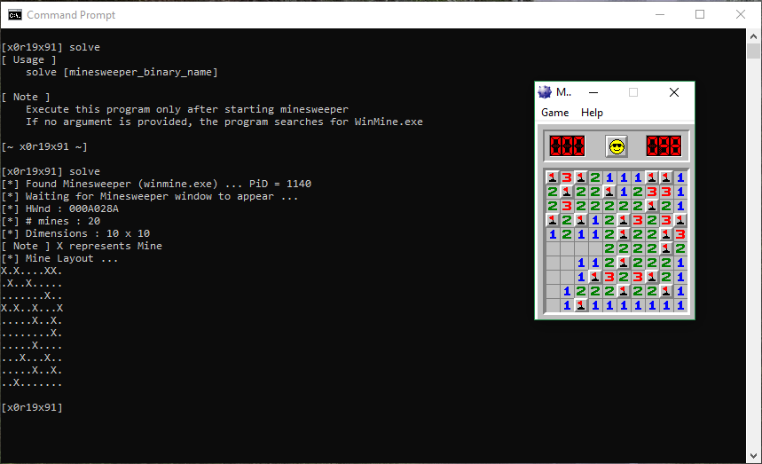

# minesweeper
Revealing the mines in the classic Minesweeper

### Details
Please visit my blog at [Minesweeper - Revealing the Mines](https://x0r19x91.github.io/2018/minesweeper-xp/)

### Compiling the source
You need to compile the source code as a 32 bit executable.

You may use cl.exe (Microsoft C++ Compiler) or gcc (with -m32)

### How to Download Minesweeper
I've downloaded the minesweeper from [Download Minesweeper](http://www.minesweeper.info/downloads/games/Winmine__XP.exe)

### Output

